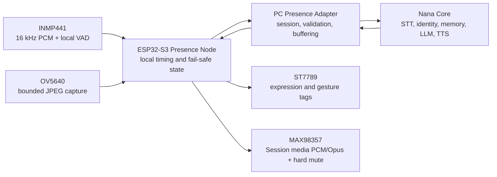

# Nana Presence Node State

Last updated: 2026-08-29 (read-only surface audit; physical evidence unchanged)

> **ESP32-OWNER-HOLD-1 = `WAITING_OWNER` / `DEFERRED` (physical execution).**
> This is a scheduling hold, not `FROZEN` and not closed. Do not flash,
> provision, wire, power-cycle, capture camera frames, use the physical
> microphone or speaker, exercise the display, run live stress, or change
> Presence hardware until Ba explicitly reopens that physical scope. All prior
> PASS and PENDING evidence remains valid and preserved.

## 2026-08-29 Owner-Authorized Read-Only Surface Audit

Ba explicitly reopened only a source/config surface audit before Core LLM
latency work. This did not reopen physical Presence execution.

Audit result:

- Current firmware selector remains `NANA_BRINGUP_PRESENCE_SESSION`.
- The latest firmware binary is about `1,146,448` bytes and was built after
  the latest Session audio source change.
- N16R8 configuration remains 16 MiB flash plus 8 MiB octal PSRAM at 40 MHz.
- PSRAM uses capability allocation rather than global malloc.
- Camera keeps one 192 KiB VGA JPEG framebuffer in PSRAM; direct camera PSRAM
  DMA remains disabled because it previously produced incomplete JPEGs.
- Large microphone capture and bounded playback buffers use PSRAM.
  I2S rings, camera staging DMA, and display transfer buffers remain in
  internal/DMA-capable RAM.
- Canonical audio GPIOs remain BCLK 41, WS 42, DOUT 47, DIN 21, amplifier SD 2.
  They do not overlap the camera bus.
- Temporary ST7789 wiring deliberately borrows microSD GPIO 38/39/40, so
  display and microSD are not simultaneous under that bench mapping.
- No new source fault or RAM/pin conflict was found. No RAM optimization,
  firmware edit, build, flash, serial operation, network call, or peripheral
  action was required by this audit.

Physical status and fixed gate count remain unchanged. Core LLM latency work
does not advance B6, D4, display replacement, Opus, or soak acceptance.

Status: **THE AUTHENTICATED WEBSOCKET SESSION IS THE ONLY PRODUCTION DEVICE
PATH. CONTROL, BOUNDED HALF-DUPLEX PCM16/16 KHZ AUDIO, BOUNDED DISPLAY
STATE/EVENT TRANSPORT, AND CAMERA -> MIC -> CORE -> SPEAKER/DISPLAY COEXISTENCE
ARE LIVE-PASSED ON THE REAL BOARD. THE REQUEST-DRIVEN OV5640 PATH USES A 192
KIB PSRAM FRAMEBUFFER WITH STAGED INTERNAL DMA; JPEG/YUNET RESULTS REMAIN
RAM-ONLY. SUPERVISOR SAFETY IS LIVE-PASSED: ACTIVE PLAYBACK FAILS BOUNDED,
THE SPEAKER HARD-MUTES, THE NODE RECONNECTS, AND THE NEXT TURN RECOVERS.
THE 2026-08-05 SOLDERED-NODE OWNER SMOKE PASSED REGULATED BATTERY POWER,
CAMERA, MICROPHONE, SPEAKER, AUDIO GATING, STT, AND REPLY PLAYBACK. THE ST7789
PANEL WAS HEAT-DAMAGED DURING ASSEMBLY AND IS PHYSICALLY BLOCKED PENDING AN
IDENTICAL REPLACEMENT; ITS PREVIOUS SESSION TRANSPORT PASS REMAINS VALID.
FINAL B6 DISPLAY/POWER ACCEPTANCE, OPUS MIGRATION, AND SOAK REMAIN OPEN. THE
FORMER USB-UART MEDIA RUNTIME REMAINS DELETED.**

Source checkpoint after the last live pass: **automatic one-time pairing,
current-user DPAPI token storage, normal-startup Presence activation,
approximately 1/2/4/5-second ESP32 reconnect, shorter production endpointing,
and per-turn latency telemetry are SOURCE/BUILD/SMOKE READY. The new firmware has not
yet been flashed or owner-accepted, so no fixed gate advances in this entry.**

This is the authoritative Level 3 subsystem wiki for Nana's ESP32-S3 Presence
Node. It records physical hardware truth, firmware truth, accepted smoke tests,
known constraints, and the exact next implementation gates.

## Owner Direction

The Presence Node is a removable physical adapter for Nana. It is not a second
Nana brain.

```text
Nana Core on PC owns:
  identity, persona, memory, social memory, relationship state,
  authorization, STT policy, LLM reasoning, TTS policy, and planning

Presence Adapter on PC will own:
  device session, protocol validation, buffering, backpressure,
  retries, health, and translation between Core events and hardware events

ESP32-S3 Presence Node owns:
  local peripheral timing, VAD capture, bounded buffering, amplifier mute,
  display animation, camera capture, watchdogs, and fail-safe local behavior
```

Current V1 target: one stationary ESP32-S3 camera board on a controlled 5 V
power path, with microphone, speaker, display, and bounded camera access. Wheels,
motors, autonomous navigation, always-on vision, and social identity enrollment
are later capabilities and are not part of this closeout.

## Decision Ledger

| Decision ID | State | Meaning |
|---|---|---|
| `PRESENCE-HARDWARE-BRINGUP-1` | CLOSED | Every current peripheral boundary passed an isolated USB-bench smoke. This does not prove simultaneous operation. |
| `PRESENCE-ADAPTER-CONTRACT-1` | PARTIAL | Session V1 is the sole production transport owner. Bounded half-duplex PCM16, bounded display commands, bounded request-driven camera JPEG framing/credits/CRC/abort, and active-media supervisor recovery are physically accepted. Opus, final pin/power ownership, and soak remain open. |
| `PRESENCE-NODE-RUNTIME-1` | PARTIAL | The selected firmware owns the authenticated Session, VAD microphone capture, full-payload speaker playback, hard MAX98357 mute, the 20 FPS display controller, one-shot OV5640 capture, and bounded worker shutdown/recovery. Camera -> mic -> Core -> speaker/display coexistence and supervisor safety are accepted; final pin/power ownership remains open. |
| `PRESENCE-VOICE-BRIDGE-1` | HISTORICAL PASS, TRANSPORT RETIRED | Two COM14 Voice Link V2 turns proved the physical mic/speaker and half-duplex policy. The runtime transport that produced this evidence was deleted on 2026-07-23. |
| `PRESENCE-DISPLAY-BRIDGE-1` | SESSION TRANSPORT + AUDIO COEXISTENCE LIVE PASS | The real board accepted eight bounded display-only commands, then completed a normal Nana mic -> Core -> speaker turn while display lifecycle events remained active. The final combined run had display ACKs `9/9`, exact speaker drain, zero underruns, no errors, and returned to `listening`. `C4`, basic-V1 `D2`, and `B3` are closed. |
| `PRESENCE-CAMERA-BRIDGE-1` | SESSION COEXISTENCE LIVE PASS | The old LAN observer remains deleted. The real board first carried three bounded VGA JPEG snapshots through the authenticated Session, then a normal Core run completed one queued RAM-only snapshot followed by mic capture, Nana processing, exact speaker drain, and display lifecycle ACKs. `B4` is closed. Identity recognition and enrollment do not exist. |
| `PRESENCE-XIAOZHI-ARCH-1` | CLOSED, RESEARCH ONLY | Official Xiaozhi documentation and source commit `5f6c09b` were reviewed. Nana will adopt persistent I2S ownership, bounded audio queues, explicit playback drain, and a future authenticated Opus/WebSocket media path without adopting Xiaozhi cloud/persona ownership. See `NANA_PRESENCE_XIAOZHI_ARCHITECTURE_REVIEW.md`. |
| `PRESENCE-SESSION-1` | LIVE PASS + CAMERA COEXISTENCE + SUPERVISOR RECOVERY | Core and ESP32 implement `nana.presence.session.v1` at `/presence/v1` with bearer authentication, `HELLO -> WELCOME`, heartbeat ACK, stale-session close, duplicate-device replacement, bounded frames, reconnect backoff, bounded microphone/speaker media, bounded display commands, and bounded request-driven camera snapshots. The current source/runtime advertises camera only when its owner is available. Physical camera transfer, Core YuNet inference, post-camera mic re-arm, exact speaker drain, display lifecycle, and active-playback interruption recovery all pass in one Session architecture. |
| `PRESENCE-AUTO-PAIR-LATENCY-1` | SOURCE/BUILD/SMOKE PASS; FLASH + OWNER TEST PENDING | One USB pairing can generate a strong shared token without displaying it, store the board copy in NVS, and protect the PC copy with Windows DPAPI. Normal Nana startup auto-enables the listener; the board actively retries at about 1/2/4/5 seconds. Production VAD retains a 2 s first calibration, then uses 750 ms recalibration and 600 ms end silence. Core now prints gate/STT/Core/TTS/playback/total timing. No live claim is made until the rebuilt image is flashed and tested. |
| `PRESENCE-SESSION-AUDIO-DOWNLINK-1` | LIVE PASS | Core sends CRC32-protected 1024-byte PCM frames under node-issued credits; ESP32 receives the complete bounded reply into PSRAM before dedicated I2S playback, and completion requires exact `playback_drained` counters. The latest long reply matched `601600/601600/601600` bytes sent/received/played with zero underruns and zero heartbeat timeouts. This replaces the retired serial route without adding a second fixed gate. |
| `PRESENCE-SESSION-AUDIO-UPLINK-1` | LIVE PASS | ESP32 VAD captures bounded PCM16/16 kHz mono into PSRAM, sends only under Core-issued credits, and does not re-arm until the Nana reply drains. Two consecutive real turns completed with accepted audio gates, correct STT, exact speaker drain, zero uplink/downlink failure, and no serial media fallback. |
| `PRESENCE-TRANSPORT-CLEANUP-1` | LIVE PASS | Core serial/camera runtime modules, legacy startup flags, `pyserial`, firmware Voice Link source, and old combined media profiles were removed. USB-UART is maintenance-only. The current LAN audio image was flashed to CH343 COM14 and accepted without restoring a serial media fallback. |
| `PRESENCE-V1-SOAK-1` | PENDING | Reconnect, failure, and 30-60 minute combined-runtime acceptance. |
| `PRESENCE-MOBILITY-1` | NOT STARTED | Motors, wheels, navigation, collision safety, and emergency-stop behavior remain outside stationary V1. |

## Progress Snapshot

Progress is counted by the fixed acceptance gates below. It is not a subjective
quality score.

| Layer | Passed | Total | Progress |
|---|---:|---:|---:|
| A. Isolated hardware and drivers | 8 | 8 | 100% |
| B. Unified node runtime | 5 | 6 | 83% |
| C. Nana Core Presence Adapter | 5 | 5 | 100% |
| D. End-to-end acceptance | 3 | 4 | 75% |
| **Stationary Presence Node V1** | **21** | **23** | **91%** |

Interpretation: the physical peripherals have accepted bench evidence, and the
current production firmware has accepted bounded half-duplex microphone and
speaker PCM plus exact-ACK display commands over the authenticated Session.
Display command transport closes `C4`; owner-observed lifecycle rendering and
return-to-rest close basic-V1 `D2`. The 2026-07-28 combined physical run closes
`B3`: microphone capture, speaker playback, and display lifecycle completed in
one authenticated Session with exact drain and no underrun. The 2026-07-30
integrated run closes `B4`: one queued RAM-only camera snapshot completed, then
the mic re-armed and a full Nana reply drained exactly while display and
heartbeat stayed responsive. The 2026-08-01 active-playback Wi-Fi interruption
closes `B5`: the speaker hard-muted immediately, the transaction failed
bounded with no underrun or queue buildup, the node reconnected, display
resynchronized, and the next owner-observed turn completed cleanly. Final pin
and power ownership, remaining media migration, memory margin, and soak remain
open. A
successful isolated peripheral smoke must never be reported as a complete Nana
hardware runtime.

The historical physical Voice smokes close `B2`, `C2`, `C3`, and `D1` for an
older PSRAM-disabled bench baseline: microphone
ingress, clean Nana reply egress, strict half-duplex ownership, automatic
re-arm, and hard idle mute are real-hardware evidence. The old fixed-sleep
transport remains historical rejected evidence; the deadline-paced transport
and strict RX teardown are the accepted baseline.

Voice Link V2 was the accepted bench transport for those same closed audio
gates. It does not increment the ledger a second time and is no longer present
in current source. Two physical turns
completed with `stop=silence`, audio scores `0.95` and `1.00`, final STT
confidence `0.944`, strict mic suspension during playback, zero skips, zero
rejects, zero protocol errors, and automatic re-arm.

## Current Hardware Truth

| Component | Current truth |
|---|---|
| Main board | ESP32-S3 WROOM N16R8 camera board, revision 0.2, dual-core 240 MHz, 16 MiB flash |
| PSRAM | 8 MiB octal PSRAM is discovered and enabled as a caps-only allocator. Current Session explicitly uses it for the bounded 640000-byte microphone capture, one playback payload up to 4 MiB, and one 192 KiB camera framebuffer. Camera DMA uses a small internal staging buffer because direct PSRAM DMA produced incomplete OV5640 JPEGs. Control queues stay bounded static internal RAM. |
| USB/UART | CH343; historical bring-up evidence used `COM14`; current policy is maintenance-only flash/log/provisioning/isolated diagnostics |
| Camera | Integrated OV5640; VGA JPEG capture works |
| Display | ST7789 1.69-inch 240x280 SPI; landscape face renderer works |
| Microphone | INMP441 I2S; raw telemetry and VAD-gated PCM capture work |
| Speaker | MAX98357 I2S amplifier plus 8 ohm / 3 W speaker; controlled playback and mute work |
| Storage | Onboard microSD slot; non-destructive 32 MiB integrity smoke passed |
| Audio decoupling | 1500 uF / 16 V electrolytic fitted across the amplifier supply near the module; isolated and integrated playback plus idle mute are owner-confirmed clean with the accepted deadline-paced transport |
| Bench power | USB power is the verified bring-up path; the final regulated 5 V / 5 A distribution path is not yet a combined-runtime acceptance result |

Final wiring still requires a physical `10 kOhm` pull-down from MAX98357 `SD`
to `GND`. Firmware already drives `GPIO2` low, but software cannot guarantee
mute before boot or during reset.

## Canonical GPIO Map

| Function | GPIO | Notes |
|---|---:|---|
| Audio BCLK | 41 | Shared mic/speaker clock |
| Audio WS/LRCLK | 42 | Shared mic/speaker word select |
| Speaker data out | 47 | ESP32 -> MAX98357 `DIN` |
| Microphone data in | 21 | INMP441 `SD` -> ESP32 |
| Amplifier enable/mute | 2 | MAX98357 `SD`; high=enabled, low=hard mute |
| Onboard status LED | 48 | Bring-up/VAD status only |
| Display MOSI | 38 | Temporary bench assignment; conflicts with onboard microSD |
| Display SCLK | 39 | Temporary bench assignment; conflicts with onboard microSD |
| Display DC | 40 | Temporary bench assignment; conflicts with onboard microSD |
| Display CS | 14 | Temporary bench assignment |
| Display RESET | 1 | Temporary bench assignment |
| microSD CMD/CLK/DATA0 | 38/39/40 | Cannot coexist with the current display wiring |

Camera GPIOs are reserved by the board: `SIOD=4`, `SIOC=5`, `VSYNC=6`,
`HREF=7`, `D2=8`, `D1=9`, `D3=10`, `D0=11`, `D4=12`, `PCLK=13`, `XCLK=15`,
`D7=16`, `D6=17`, and `D5=18`.

The final one-board pin contract must resolve the display/microSD conflict
before combined firmware is accepted. Valid outcomes are an alternate display
SPI allocation or an explicit V1 decision to leave microSD unused. Silent pin
reuse is forbidden.

## Current Firmware Truth

Firmware root:

```text
<NANA_REPO>\nana_presence_node
```

`main/app_main.c` currently has a compile-time selector with six isolated
diagnostic profiles and one production Session profile:

```text
NANA_BRINGUP_CAMERA_LAN
NANA_BRINGUP_CAMERA_SERIAL
NANA_BRINGUP_MICROPHONE
NANA_BRINGUP_MICROPHONE_VAD_SERIAL
NANA_BRINGUP_SPEAKER
NANA_BRINGUP_DISPLAY
NANA_BRINGUP_PRESENCE_SESSION
```

The local source selector and build output on 2026-07-24 are:

```text
NANA_BRINGUP_PRESENCE_SESSION
```

This is the sole production profile. It starts saved-credential Wi-Fi and the
authenticated Session client, initializes bounded microphone and speaker
workers, starts the 20 FPS display controller, exposes request-driven camera
capture, and keeps MAX98357 hard-muted except during accepted playback. The
camera owner suspends mic capture, starts one bounded VGA/JPEG acquisition,
uploads under Core-issued credits, stops the sensor, then restores mic
ownership. The last owner-accepted image remains flashed and retains the
token-authenticated camera/media evidence. The 2026-08-06 reconnect/VAD source
revision is not live evidence until it is built, flashed, and tested.

The isolated profiles remain available for intentional one-device diagnostics.
The former `NANA_BRINGUP_VOICE_LINK_V2` and
`NANA_BRINGUP_PRESENCE_V1` production media profiles and their shared
`nana_voice_link.c` implementation were deleted on 2026-07-23. Core removed the
matching serial owner and camera observer at the same boundary.

### Historical COM14 Media Evidence

The 2026-07-20/21 COM14 runs remain valid evidence that INMP441 capture,
MAX98357 playback/hard mute, half-duplex ownership, VAD endpointing, audio
quality gating, STT, Nana reply generation, display tags, and bounded camera
presence can work on this hardware. They also exposed and corrected UART
underrun pacing and I2S DMA allocation pressure. Those results close previously
counted hardware gates, but their transport is retired and cannot be selected
or started by current Core or firmware.

Do not reconstruct the deleted route from this history. The reusable policies
are the audio quality gate, human-presence gate, hard-mute rules, bounded queue
requirements, and isolated peripheral diagnostics. Production bytes now belong
on `nana.presence.session.v1` only.

### 2026-07-21 Xiaozhi Review And Experimental Branch

The owner supplied the official Xiaozhi documentation and allowed the research
session to open additional Edge debug tabs. The review covered WebSocket,
MQTT/UDP, MCP, hardware, programming, troubleshooting, and the current
`xiaozhi-esp32` source at commit
`5f6c09b8938ad08c6a16c0b1f526638207e58ed6`.

The architecture review is recorded in
`NANA_PRESENCE_XIAOZHI_ARCHITECTURE_REVIEW.md`. Its immediate conclusions are:

- the clean speaker-only embedded PCM smoke means GPIO 41/42/47 is not proven
  defective;
- the strongest recent reply failure remains
  `stage=payload_read`, `ESP_ERR_TIMEOUT`, with 17408 bytes missing;
- persistent I2S channels, bounded receive/decode/playback queues, node-side
  flow control, and a real `playback_drained` event must be tested before a pin
  remap;
- the primary media path should remain authenticated WebSocket; PCM16 is the
  accepted baseline and Opus is the later bandwidth optimization, while
  USB-UART remains diagnostics and recovery;
- MQTT/UDP, full duplex/AEC, mobility, and on-device identity stay deferred.

ESP-IDF discovers and initializes the board's 8 MiB octal PSRAM with
`CONFIG_SPIRAM_USE_CAPS_ALLOC=y`. Current Session explicitly allocates bounded
capture, full-playback payloads, and one 192 KiB camera framebuffer there while
keeping control queues and camera DMA staging bounded in internal RAM. Earlier
general-heap integration reproduced an `IllegalInstruction` reset; direct
camera PSRAM DMA later produced incomplete JPEGs. The accepted compatibility
mode keeps direct PSRAM DMA disabled and copies through a small internal DMA
staging buffer into the PSRAM framebuffer. Build-time guards prevent accidental
re-enablement or transport/framebuffer bound drift.

## Target Integration Boundary



Retired USB media boundary:

- Voice Link V2, the serial camera observer, old Core startup flags, and the
  combined media firmware profile were removed on 2026-07-23.
- `/presence-node-status` and `/presence-node-diagnostics` now alias Session
  diagnostics. They do not inspect or open a serial media device.
- USB-UART remains only for flash, logs, one-time NVS Session provisioning, and
  explicitly selected isolated bench profiles.
- Transport-neutral policies survive: strict half-duplex ownership, hard mute,
  bounded payload validation, audio quality before STT, human-presence policy,
  and fail-closed cancellation.
- Future microphone, speaker, camera, and display traffic must use bounded
  frames and queues owned by the authenticated Session lifecycle.

Implemented for the new control-plane boundary:

- Core owns an opt-in `nana.presence.session.v1` WebSocket listener at
  `/presence/v1`. The opening HTTP handshake requires a bearer token.
- ESP32 sends a versioned hello containing device ID, firmware, profile, and
  explicit milestone capabilities; Core returns a session ID and heartbeat
  interval.
- Heartbeat sequence ACK, stale-session timeout, duplicate-device replacement,
  bounded JSON-only frames, manual reconnect backoff, and redacted diagnostics
  passed Core loopback smokes. Firmware compiles under ESP-IDF 5.5.5.
- The direct LAN URI and token are provisioned once over USB-UART and stored in
  NVS. USB is provisioning/recovery only; it is not the primary session link.
- The 2026-07-22 physical preflight flashed and booted the control-only image,
  confirmed 8 MiB PSRAM discovery, hard mute, and Wi-Fi `<LOCAL_IP>` on the
  same `/24` as Core `<LOCAL_IP>`. The first TCP attempt exposed an explicit
  Public-profile inbound block for `python.exe`; the owner then installed the
  program-, TCP `8765`-, and `<LOCAL_IP>/24`-scoped firewall rule and disabled
  the conflicting broad auto-generated Python rules.
- The repeated physical acceptance then passed all four stages: initial
  authenticated hello plus three heartbeats, reconnect after Core listener
  restart, reconnect after ESP32 hard reset, and ephemeral URI/token removal
  from NVS. A final clean boot proved `SD=GPIO2 LOW`, `DIN=GPIO47 LOW`, no saved
  session configuration, and no leftover Core listener.
- The first post-firewall retry exposed a host-tool race rather than a firmware
  parser defect: USB-UART commands were transmitted while the ESP32 was still
  booting. `provision_presence_session.py` now waits for the firmware readiness
  or live-session marker before its first write; a controlled one-shot
  `READY -> SAVE -> CLEAR` test and the full `4/4` smoke both passed afterward.
- The 2026-07-23 D3 run physically stopped the ESP32 radio for 3 seconds and
  recovered a new authenticated session. It also recovered after Core listener
  loss, rejected malformed Core frames with bounded increasing backoff,
  canceled during reconnect with zero stale reconnects, and released the
  listener after repeated shutdown. The temporary token was cleared from NVS.
- The owner then provisioned the real Core URI and bearer token into NVS using
  the maintenance-only USB-UART tool. With the Core launcher still listening,
  a physical node power-cycle produced a second connection and one active
  authenticated session from `<LOCAL_IP>`; heartbeats advanced with zero
  timeouts. No repeat provisioning was needed.
- The same durable session carried one real Nana reply end to end: `71680`
  bytes sent, `71680` received, `71680` played, queue high-water `8`, zero
  underruns, zero failures, and exact `complete` drain after `4000ms`.

Still proposed for the broader multi-peripheral adapter:

- DHCP discovery or a stable local hostname. Session V1 still provisions a
  direct private-LAN URI and must be updated if the PC address changes.
- Bounded microphone uplink and later Opus migration over the accepted session.
- Display event transport through the same PC-side ownership boundary.
- Identity recognition, consent, enrollment, and social-memory lookup remain a
  later capability behind confirmed presence. Nana Core does not consume a
  permanent raw camera stream.
- Bounded queues everywhere. A slow PC or network drops/cancels bounded work;
  it must not consume heap indefinitely.
- No memory, face embedding, relationship record, API key, or Nana identity
  database is stored on the ESP32.

## Smoke-Test Ledger

### A. Isolated Hardware And Drivers - 8/8

| Gate | State | Evidence | Boundary |
|---|---|---|---|
| `A1-BOARD-UART` | PASS | ESP32-S3 rev 0.2, 16 MiB flash, CH343/COM14 identified; build, flash, monitor, and heartbeat work | Does not prove peripherals |
| `A2-SD-INTEGRITY` | PASS | Onboard microSD identity plus non-destructive 32 MiB integrity smoke passed | Display currently borrows the same pins |
| `A3-SPEAKER-BEEP` | PASS | Owner heard five beeps with the requested count and spacing | Synthetic tone only |
| `A4-SPEAKER-VOICE-MUTE` | PASS | Embedded Nana sample played clearly; 1500 uF supply capacitor removed idle hum; firmware logged mute -> enable -> mute and transmitted the full sample once | Final 10 kOhm hardware pull-down still required |
| `A5-MIC-TELEMETRY` | PASS | INMP441 produced non-zero I2S level telemetry with the expected active channel | Levels only, not speech semantics |
| `A6-MIC-VAD-PCM` | PASS | 16 kHz mono VAD packet passed CRC and produced a WAV the owner heard as clear | Serial one-shot capture only |
| `A7-CAMERA` | PASS, BOUNDED | OV5640 detected; VGA JPEG still, microSD export, serial capture, token-protected LAN capture, and one-client MJPEG viewer worked; PC face detection drew a box | 5 FPS cap, PSRAM disabled, no identity recognition |
| `A8-DISPLAY` | PASS | Color/orientation passed; 280x240 landscape renderer ran at 20 FPS; owner retained 38 tags with smooth blink and event animation | Display-only profile; no Core event source |

Speaker lifecycle evidence from the latest controlled firmware:

```text
I (375)  MAX98357 muted at startup: SD=GPIO2 LOW
I (2505) MAX98357 enabled: SD=GPIO2 HIGH
I (8695) MAX98357 muted: SD=GPIO2 LOW
I (8695) Nana voice smoke: PASS (6-second sample transmitted once)
heartbeat: free_heap=380772 | min_heap=374024
```

Microphone V2 VAD contract:

```text
16 kHz mono PCM
2 s first-boot noise calibration; 750 ms fresh recalibration after later turns
250 ms pre-roll
160 ms speech trigger
600 ms silence stop
250 ms retained tail
short captures are sent to the Core quality gate, not trusted locally
hard cap at 20 s
ordered chunk stream plus aggregate CRC32
```

Display contract:

```text
23 persistent expression tags
15 one-shot gesture tags
neutral = default baseline with varied idle blink
mic_unclear = narrowed eyes plus question mark
core_loading = cyan spinner after valid audio handoff
panic = the only current tag with a mouth
```

### B. Unified Node Runtime - 5/6

| Gate | State | Acceptance |
|---|---|---|
| `B1-PIN-DRIVER-CONTRACT` | PASS | Canonical GPIO constants and isolated driver entrypoints exist |
| `B2-AUDIO-HALF-DUPLEX` | PASS | Two physical turns proved one shared-clock owner, capture -> playback switching, hard mute while listening/idle, and automatic recalibration/re-arm after each reply |
| `B3-DISPLAY-COEXISTENCE` | PASS | Owner-accepted real mic -> Core -> speaker operation completed while bounded display lifecycle events remained responsive and returned to `listening`; exact playback drain, zero underruns, and zero runtime errors were recorded |
| `B4-CAMERA-COEXISTENCE` | PASS | After the three-frame camera E2E smoke, a normal Core run queued one RAM-only snapshot until the media lease was idle, detected one face at `0.938`, then completed post-camera mic capture, Nana reply playback, and four display ACKs. Camera/audio/display failures were zero, heartbeat timeouts were zero, playback drained exactly, and no error remained. |
| `B5-SUPERVISOR-SAFETY` | PASS | The Session supervisor owns bounded audio/uplink/camera worker startup and acknowledged reverse-order rollback. Core interruption and partial-listener-start regressions pass. During owner-observed active playback, a bounded three-second radio interruption caused one exact playback failure, immediate silent hard mute, zero underruns, zero queue buildup, authenticated reconnect, display resync, and a clean subsequent mic -> Core -> speaker/display turn. |
| `B6-FINAL-PIN-POWER-CONTRACT` | PARTIAL LIVE PASS; DISPLAY REPLACEMENT BLOCKED | The 2026-08-05 owner smoke passed the soldered node on the regulated battery path: camera, microphone, speaker, audio gate, STT, and Nana reply playback were stable. The ST7789 panel was heat-damaged during assembly, so B6 remains open until the identical replacement is installed and continuity, rail voltage, boot mute, display, and combined-load checks pass. |

V1 audio is intentionally half-duplex. The microphone and speaker share
`BCLK=41` and `WS=42`, but use different sample rates. Full duplex, echo
cancellation, and simultaneous listen/speak are not current acceptance targets.

### C. Nana Core Presence Adapter - 5/5

| Gate | State | Acceptance |
|---|---|---|
| `C1-SESSION` | PASS | The real board completed authenticated hello/capabilities, advancing heartbeat health, reconnect after Core restart, reconnect after board reboot, and ephemeral NVS cleanup over the scoped private-LAN firewall rule. |
| `C2-MIC-INGRESS` | PASS | Two physical INMP441 VAD packets reached the existing Nana STT path with correct transcripts, bounded framing, and no duplicate turn |
| `C3-VOICE-EGRESS` | PASS | Current authenticated Session PCM reached MAX98357 through bounded credit flow and exact drain accounting; physical tone and real VoiceEngine reply completed with zero underruns, then returned to hard mute |
| `C4-DISPLAY-EVENTS` | PASS | Core maps state to approved persistent/one-shot tags, unknown tags fail closed, and the real display-capable node accepted eight exact-ACK state/event commands with zero rejects or failures |
| `C5-CAMERA-SAMPLING` | PASS | One Core observer owns token-protected snapshots at no more than 1 Hz, keeps JPEGs in RAM, produces presence-only events, and drives the leased fail-closed board audio gate; no identity inference runs |

Session V1 physical and staged-display evidence:

```text
Core WebSocket media/display/camera/supervisor smoke: PASS 18/18
Core YuNet camera-vision smoke: PASS
Firmware supervisor source-contract smoke: PASS
Voice audio-completion regression: PASS 10/10
Core startup-config contract: PASS 18/18
Core runtime lifecycle: PASS 9/9
ESP-IDF 5.5.5 build: PASS
Supervisor-staged source build: 0x117990 bytes; 0x5f670 bytes (25%) app-partition free
Supervisor-staged SHA-256: 95103291069ABCE4E61D6CB9E143E9507F8FA728196F196747DFBFE023F22E28
Physical active-playback supervisor interruption: PASS, owner accepted 2026-08-01
Runtime image hash attestation: not advertised by the current Session protocol
Physically flashed runtime-equivalent camera image: 0x116f00 bytes
Physically flashed image SHA-256: 302566E7B89D3FBABE5F0C5FF33D218B9AD68186B9583AC4A102172A4A0CA53E
Flashed media capabilities: audio_uplink/downlink/display/camera=true when each owner starts
ESP32 flash/boot: PASS; MAX98357 hard-muted while idle
Core LAN URI: re-provisioned from stale <LOCAL_IP> to <LOCAL_IP> on 2026-08-01; verify current DHCP address before each physical run
Scoped firewall: PASS; exact Python program, TCP 8765, remote <LOCAL_IP>/24
Initial HELLO/WELCOME plus 3 heartbeats: PASS
Reconnect after Core listener restart plus 3 heartbeats: PASS
Reconnect after ESP32 hard reset plus 3 heartbeats: PASS
Physical bounded-tone Session smoke: PASS 5/5
Tone: 32000 bytes; queue_high_water=8; underruns=0; elapsed=1828 ms
Physical VoiceEngine -> Session -> MAX98357 smoke: PASS 4/4
Voice: 225280 bytes; underruns=0; elapsed=7803.7 ms
Durable full turns on 2026-07-24: PASS 2/2
Latest capture: 177984B wire / 160384B effective; audio gate PASS 0.91
Latest reply: 601600B sent/received/played; underruns=0; elapsed=29594ms
Display state/event ACK, allowlist, reconnect resync: logical PASS
Physical display-only Session smoke: PASS 8/8 exact ACKs; rejects=0; failures=0; heartbeats=3; errors=0
Normal Nana display lifecycle: OWNER PASS; expression changed and returned cleanly to resting state
Display + live audio coexistence on real board: PASS under B3 on 2026-07-28
Combined run: uplink completed=2/rejected=1/failed=0; downlink completed=2/failed=0
Combined display: sent=9; accepted=9; rejected=0; failed=0; final=listening
Combined playback: 92160/92160/92160B sent/received/played; queue_high_water=0; underruns=0; elapsed=4703ms
Combined runtime: active=1; heartbeat timeouts=0; last_error=none; owner accepted physical speaker and TFT operation
Post-Session camera driver lifecycle: PASS; OV5640 VGA/JPEG start, warmup, and stop after Session workers plus mic suspend
Camera allocation: 192 KiB PSRAM framebuffer; staged internal DMA; direct PSRAM DMA disabled
Authenticated Session camera transfer + YuNet owner smoke: PASS 3/3 on 2026-07-30
Camera frames: 640x480; 18385B/18615B/18873B; transfer=2015ms/1719ms/1734ms
YuNet: face present 3/3; confidence=0.933/0.938/0.936; persistence=none
Camera smoke runtime: active=1; heartbeats=2; errors=0
Integrated camera coexistence on real board: PASS under B4 on 2026-07-30
Queued snapshot: face=1; confidence=0.938; frame=640x480; jpeg=18590B; transfer=1578ms; YuNet=23.1ms; persistence=none
Post-camera audio gate: PASS 0.84; speech=2490ms/40%; SNR=9.7dB; transcript correct
Post-camera capabilities: camera=1/1; uplink=1/1; downlink=1/1; display=4/4; failures=0
Post-camera playback: 120320/120320/120320B sent/received/played; queue_high_water=0; underruns=0; elapsed=5672ms
Post-camera runtime: active=1; heartbeats=16; heartbeat_timeouts=0; last_error=none; diagnosis=AUDIO_READY
Ephemeral NVS URI/token cleanup after each physical smoke: PASS
Post-cleanup boot: PASS; MAX98357 SD/DIN LOW; provisioning wait; listener_count=0
Physical D3 matrix: PASS 6/6
Wi-Fi radio interruption: 3 seconds; new session and heartbeat recovered
Core loss/recovery: PASS; newest-session owner retained
Malformed frames: fail-closed; bounded backoff 2.14s -> 3.20s; recovery PASS
Cancel during reconnect: token cleared; stale reconnects=0
Repeated shutdown: listener rebound; active_sessions=0
```

Physical assembly checkpoint on 2026-08-05:

```text
Regulated battery-powered soldered node: OWNER PASS
Camera: OWNER PASS in the post-assembly round
Microphone/STT: PASS; four meaningful captures accepted with SNR 9.5-14.1 dB
Ambient/no-speech filtering: PASS; five unstable/low-confidence captures rejected before STT
Speaker/Nana reply playback: OWNER PASS; clear output and no reported hum/stutter
Runtime errors before intentional Ctrl+C shutdown: none observed in the supplied log
ST7789 physical panel: BLOCKED; heat-damaged during soldering, replacement ordered
Previous display Session protocol/animation evidence: PRESERVED, but not a pass for the replacement panel
B6 closeout: NOT YET; rerun continuity, rail, boot-mute, display, and combined-load checks after replacement
```

### D. End-To-End Acceptance - 3/4

| Gate | State | Acceptance |
|---|---|---|
| `D1-ONE-TURN-VOICE` | PASS | A physical mic -> STT -> Nana -> TTS -> speaker turn completed cleanly; mic stayed `suspended` throughout playback and reinitialized only after speaker mute and turn completion |
| `D2-STATE-SYNCHRONY` | PASS | Exact transport smoke covered persistent states and one-shot events; lifecycle mappings and fail-closed paths are logic-tested; in the normal Nana runtime the owner observed the physical expression change and return cleanly to its resting state. Additional expression variety and animation polish are post-V1 enhancements, not blockers for this basic gate. |
| `D3-FAILURE-RECONNECT` | PASS | Core loss, real 3-second ESP32 radio interruption, malformed frames, cancellation during reconnect, board reboot, and repeated shutdown all recovered or failed closed. The later B5 run also interrupted active physical playback: hard mute was immediate, failure stayed bounded, reconnect and display resync succeeded, and the next full turn recovered. |
| `D4-SOAK` | PENDING | 30-60 minutes with bounded heap, no watchdog, no stuck display event, no audio leak, and clean reconnect |

## Known Constraints And Risks

1. PSRAM is physically present, boot-initialized, and used through explicit
   capability-based allocations for bounded capture, playback, and one 192 KiB
   camera framebuffer. Do not enable broad PSRAM heap ownership or direct
   camera PSRAM DMA: the former reset this board and the latter produced JPEGs
   without a valid EOI marker.
2. LAN MJPEG remains deliberately capped by
   `NANA_CAMERA_STREAM_INTERVAL_MS=200`, or 5 FPS, for manual diagnostics only.
   Core does not consume MJPEG; its presence observer requests at most one JPEG
   snapshot per second and may run slower when capture latency exceeds 1 second.
3. The selected production firmware initializes the camera only for an
   authenticated one-shot request. Session migration, full transfer, Core
   YuNet presence inference, and post-camera audio/display resume pass
   physically after mic/Session allocation pressure. Sustained heat/power is
   still part of final pin/power and soak acceptance.
4. Display bench pins conflict with onboard microSD. This is a hard integration
   gate, not a documentation footnote.
5. USB power passed isolated smokes only. It does not prove simultaneous camera,
   display, Wi-Fi, microphone, and speaker peak load.
6. The old combined camera/display/audio runtime was retired. Current Session
   advertises `audio_uplink=true`, `audio_downlink=true`, `display=true`, and
   request-driven `camera=true` when owners start. Request-driven peripheral
   coexistence is accepted; sustained memory margin and long-run load are not.
7. PC-side face detection passed only as object detection. Person identity,
   consent, enrollment, relationship memory, and authorization do not exist.
8. CH343 activity is maintenance traffic only. Production media must not depend
   on the USB cable. `GPIO2` remains the MAX98357 hard-mute owner: low at boot,
   idle, disconnect, underrun, abort, and shutdown; high only while the speaker
   worker owns accepted playback.
9. Presence currently means "YuNet found a face," not "a full human body is in
   frame." This conservative proxy is enough to gate audio V1 but must not be
   described as identity recognition or general person detection.

## Next Implementation Order (HISTORICAL / DEFERRED UNDER OWNER HOLD)

The following B6, D4, exact-1500, backup, and Opus items are the historical
next order from
the last active Presence session. They are not commands to run while
`ESP32-OWNER-HOLD-1` is active.

1. Resolve `B6-FINAL-PIN-POWER-CONTRACT`: final 5 V distribution,
   fuse/switch, decoupling, boot-time amplifier pull-down, and combined-load
   acceptance without changing the closed media ownership rules.
2. Run `D4-SOAK` for 30-60 minutes with bounded heap, no watchdog, no stuck
   display event, no audio leak, clean camera lease, and reconnect recovery.
3. Keep the exact-1500 owner-heard stress gate pending; do not invoke it during
   the hold.
4. Create a verified backup and close stationary V1. Add Opus only after the
   PCM baseline remains clean, while preserving maintenance-only USB
   diagnostics and the one-brain Core boundary.

## Scope Locks

Do not add any of the following before stationary V1 acceptance:

- wheel, motor, mecanum, track, navigation, or emergency-stop control code;
- always-on face recognition or automatic person enrollment;
- social-memory schema on the ESP32;
- full-duplex audio or acoustic echo cancellation;
- LLM, TTS provider, or long-term memory execution on the ESP32;
- a generic plugin framework, message broker, or task manager without evidence;
- camera resolution/FPS expansion before the PSRAM and power gates close.

## Build And Verification Anchors

```powershell
& '<ESP_IDF>\export.ps1'
Set-Location '<NANA_REPO>\nana_presence_node'
idf.py build
idf.py -p COM14 flash
```

Do not leave `idf.py monitor` open while Nana Core owns the port.

Verification completed on 2026-07-20:

```text
ESP-IDF Presence V1 firmware build: PASS
nana_presence_node.bin: 0xf4370 bytes in 0x177000 app partition; 0x82c90 bytes (35%) free
Presence V1 flash to CH343 COM14: PASS
Firmware heartbeat: PASS (presence_v1; protocol=v2; mic=suspended; speaker=muted; turn=display_only)
Physical V2 utterance/reply transport: PASS (2/2 consecutive turns)
Physical V2 endpointing: PASS (stop=silence on both turns)
Physical V2 audio/STT gates: PASS (score=1.00; SNR=19.2dB; confidence=0.944)
Physical transport/re-arm: PASS
Original physical reply quality: REJECTED (audible stutter/pops)
Deadline-paced reply quality: PASS (owner accepted clean playback)
Strict half-duplex telemetry: PASS (mic suspended for all speaker playback)
Automatic post-reply microphone re-arm: PASS
Presence audio quality smoke: 3/3 PASS
Presence human gate smoke: 6/6 PASS
Presence camera observer smoke: 3/3 PASS
Presence Voice Link V2 smoke: 9/9 PASS
Core config contract: 17/17 PASS
Core runtime lifecycle: 9/9 PASS
Core runtime ownership: 6/6 PASS
Core architecture guard: 3/3 PASS
Command registry truth: 12/12 PASS
/presence-node-status and diagnostics: PASS, read-only, no serial/API call
Live camera observer: PASS (2/2 frames detected; confidence=0.8585; 640x480)
Live Core/board audio gate synchronization: PASS (open on confirmed presence; closed on observer stop)
Live combined startup: PASS (camera evidence armed mic; unstable background audio rejected before STT)
```

Additional verification on 2026-07-21:

```text
Physical Japanese reply playback after UART pacing/ring correction: PASS
Observed reply lifecycle: speaker=playing -> speaker=muted -> turn=complete
Mic re-arm failure root cause: CONFIRMED (ESP_ERR_NO_MEM in I2S RX DMA allocation)
Microphone DMA ring: reduced from about 16 KiB to about 4 KiB
Speaker DMA ring: reduced from about 8 KiB to about 2 KiB
PCM/VAD quality contract: UNCHANGED (16 kHz mono Voice Link PCM)
ESP-IDF Presence V1 firmware build: PASS
nana_presence_node.bin: 0x1012d0 bytes in 0x177000 app partition; 0x75d30 bytes (31%) free
Presence V1 flash to CH343 COM14: PASS; image hashes verified
Post-flash mic init with camera/display: PASS (mic=armed; no ESP_ERR_NO_MEM)
Post-flash gate-cancel/re-arm smoke: PASS (2 valid cycles; 1 HTTP-open timeout stayed fail-closed)
Post-flash multi-turn mic -> Core -> speaker smoke: PASS (2/2 completed; errors=0; automatic re-arm)
```

Current Session activation is opt-in and normal Nana startup remains unchanged:

```bat
python <NANA_REPO>\nana\tools\run_presence_session_core.py
```

The launcher prompts for the bearer token and starts the authenticated Session
listener. `pyserial` is no longer a Nana Core dependency. Use
`/presence-session-status` or `/presence-session-diagnostics`; the
`/presence-node-*` spellings are equivalent read-only aliases. The retired
observer/serial camera commands and serial startup variables no longer exist.
The current `/presence-camera-snapshot` action queues one RAM-only Session
snapshot for at most 30 seconds while waiting for an idle media lease.

Physical test rule: do not flash a profile that emits audio, starts a camera,
or records a microphone unless Ba is present and explicitly asks for that live
smoke. Power off before changing wires. Never connect USB and an unverified
external 5 V path simultaneously.

Current acceptance note: the 2026-07-22 control-only Session image passed
physical `C1`; the 2026-07-23 D3 matrix then passed `6/6`. The currently
flashed image carries bounded half-duplex microphone and speaker PCM,
bounded display state/events, and request-driven camera snapshots. Audio passed two consecutive real turns on
2026-07-24; the longer reply drained all `601600` bytes with zero underruns.
The display-only physical smoke then accepted `8/8` exact commands with zero
rejects/failures. The later B3 run proved simultaneous mic/speaker/display
behavior. Camera transport, its post-Session driver lifecycle, and the
authenticated three-frame Session/YuNet path pass. The final B4 run then proved
post-camera mic/display/audio resume with exact playback and no runtime error.

Current verification on 2026-07-30:

```text
Core config contract: 18/18 PASS
Core runtime lifecycle: 9/9 PASS
Core Session server media/display/camera flow control: 16/16 PASS
Core YuNet camera vision: PASS
Camera command queue: 3/3 PASS
Command registry truth: 12/12 PASS
Core architecture guard: 3/3 PASS
Voice audio completion regression: 10/10 PASS
Edited Python compile: PASS
Legacy Core serial/camera modules: DELETED
Legacy firmware Voice Link source/profiles: DELETED
Core pyserial dependency: REMOVED
ESP-IDF 5.5.5 clean build: PASS
nana_presence_node.bin: 0xfe940 bytes; 32% app-partition margin
Physical tone/Session smoke: 5/5 PASS on CH343 COM14; underruns=0
Physical VoiceEngine/Session smoke: 4/4 PASS on CH343 COM14; underruns=0
Durable half-duplex turns: 2/2 PASS; latest reply=601600B; underruns=0
Display-capable binary: FLASH PASS; DISPLAY SESSION TRANSPORT 8/8 LIVE PASS
Display/audio lifecycle coexistence: OWNER PASS on 2026-07-28
Camera/audio/display lifecycle coexistence: B4 LIVE PASS on 2026-07-30
Physical D3 failure/reconnect matrix: 6/6 PASS on CH343 COM14
```

## Handoff Summary

```text
PRESENCE NODE STOP POINT 2026-08-01:
- PRESENCE-TRANSPORT-CLEANUP-1 is LIVE PASS.
- PRESENCE-SESSION-AUDIO-UPLINK-1 and DOWNLINK-1 are LIVE PASS.
- Isolated hardware bring-up is CLOSED: 8/8 historical bench evidence.
- Stationary Presence Node V1 is 21/23 gates (91%).
- B5-SUPERVISOR-SAFETY is LIVE PASS. Active playback hard-muted immediately
  during the bounded radio interruption, failed exactly without underrun or
  queue growth, reconnected, resynchronized display, and recovered on the next
  owner-confirmed full turn.
- Only production profile: NANA_BRINGUP_PRESENCE_SESSION.
- Only production link: authenticated nana.presence.session.v1 over
  Wi-Fi/WebSocket at /presence/v1.
- Old Core serial Voice Link/camera observer and old firmware media profiles are
  deleted. USB-UART is maintenance-only and cannot carry production media.
- Session control passed bearer auth, hello/welcome, heartbeat, stale close,
  duplicate replacement, bounded reconnect, real LAN handshake, Core restart,
  board reboot, physical Wi-Fi interruption, malformed-frame rejection,
  cancellation cleanup, repeated shutdown, ephemeral credential cleanup, and
  durable NVS provisioning plus power-cycle reconnect.
- The current source/flashed image advertises audio_uplink/downlink/display/
  camera=true when owners start. MAX98357 remains hard-muted outside accepted
  playback.
- PCM uses 1024-byte CRC32 frames, credits, explicit PSRAM payloads, bounded
  internal-RAM control queues, dedicated workers, abort, and exact drain.
- Core config 18/18, lifecycle 9/9, Session media/display/camera/supervisor 18/18,
  audio completion 10/10, Python compile, and ESP-IDF build pass. The current
  audio image is flashed; physical tone is 5/5, real VoiceEngine output is 4/4,
  physical D3 remains 6/6, and two current full turns passed. The longer reply
  completed `601600/601600/601600` sent/received/played bytes with zero
  underruns.
- Display Session state/event control, exact ACK matching, approved tags, and
  reconnect resync are implemented and live-passed. The 2026-07-28 combined
  run completed live microphone ingress, Nana reply playback, and display
  lifecycle together: display `9/9` accepted, playback
  `92160/92160/92160` bytes, zero underruns, zero failures, final `listening`.
  The owner accepted the physical speaker and TFT result. This closes `B3` in
  addition to the already closed `C4` and basic-V1 `D2`.
- Camera Session framing/credits/CRC/cancel and Core YuNet vision smokes pass.
  The real OV5640 starts, warms, and stops after Session workers and mic suspend
  using one 192 KiB PSRAM frame plus staged internal DMA. After the `3/3`
  camera smoke, an integrated normal-Core run queued one snapshot, found one
  face at `0.938`, and then completed mic -> Core -> speaker/display cleanly.
  Camera, uplink, and downlink each completed `1/1`; display accepted `4/4`;
  playback was exact at `120320/120320/120320B`; underruns, heartbeat timeouts,
  transport failures, and last error were all zero. This closes `B4`.
- The reproducible supervisor source build passes at 0x117990 with 25% margin.
  The current protocol does not attest the running image hash; physical B5 is
  accepted from bounded runtime telemetry plus the owner's immediate-mute and
  clean-recovery observations.
- Old COM14 media runs remain evidence for physical hardware gates only.
- Next: resolve the final pin/power contract under `B6`, then run `D4-SOAK`.
  Face identity and enrollment remain explicitly deferred. Opus follows only
  after the PCM baseline remains stable.
- Preserve one-brain rule: PC Nana Core owns identity, memory, STT/LLM/TTS.
- Preserve isolated bring-up profiles as maintenance diagnostics.
- Do not add USB media fallback, mobility, always-on identity recognition, or
  full-duplex audio.
```

## 2026-08-06 Progressive PCM Downlink

The current Session firmware is beyond the older control-only description.
After the latest build it advertises and accepts `audio_downlink_stream=true`.
Core may begin a playback stream with unknown final length, send bounded
credited 1024-byte PCM frames, and close it with the observed byte/sample
totals. The node keeps the existing CRC32, half-duplex lease, hard mute, abort,
and exact-drain rules.

Playback uses eight frames of PSRAM prebuffering (256 ms at 16 kHz mono) before
opening the speaker. This is deliberately conservative while the physical
audio path is being stabilized. The node has 8 MB PSRAM; the streaming payload
limit is bounded at 4 MB. The complete-buffer path remains the fallback.

Local proof: Session server 19/19, VoiceEngine PCM 7/7, supervisor contract
PASS, ESP-IDF 5.5.5 build PASS, and COM14 ESP32-S3 chip/PSRAM probe PASS. The
owner's power-cycle reconnect also passes. Physical progressive voice timing
still needs a short live test.

The known display replacement damage remains a separate B6 hardware issue; it
does not block the audio transport test when the display is left disconnected.

## 2026-08-06 Progressive Refill Follow-Up

The owner live-accepted progressive startup speed and exact playback on short
and medium replies, with first audio at 469-515 ms and zero node underruns.
An occasional light buzz remains physically unclassified.

Core now reads provider PCM in 2048-byte blocks (64 ms) instead of 8192-byte
blocks (256 ms). The node remains unchanged: 1024-byte credited frames, eight
frame/256 ms PSRAM prebuffer, CRC32, hard mute, half duplex, and exact drain.
The smaller Core read block gives four refill opportunities per node prebuffer.

New owner test: `/presence-stream-tone` sends four seconds of generated 440 Hz
PCM through the same Session/PSRAM/I2S path and bypasses ElevenLabs, STT, LLM,
and microphone input. Local regression proof is green (tone 4/4, source
telemetry PASS, Session server 19/19, HTTP stream 32/32, registry 12/12,
compile PASS). Physical tone and post-change real-voice listening remain OPEN.

## 2026-08-07 Core-Side Jitter Buffer

The live 4-second generated tone passed exact transport accounting at
`128000/128000/128000B`, queue high-water 7, first audio 406 ms, and zero node
underruns. A 99-character ElevenLabs reply passed at
`299520/299520/299520B`, first audio 531 ms, and zero underruns. These results
exclude hard WebSocket frame loss but do not by themselves classify every
short audible artifact.

Core now prefetches provider PCM into a bounded 64 KiB queue before the
credited Session sender consumes it. This removes node-credit pacing from the
HTTP read loop and supplies roughly two seconds of Core-side jitter reserve.
No node source, pins, NVS data, or firmware image changed. Automated evidence:
source telemetry/read-ahead PASS, Presence PCM 7/7, tone 4/4, Session 19/19,
HTTP streaming 32/32, registry 12/12, and Python compile PASS.

Next physical evidence is one short and one medium reply followed by
`/voice-status`. Prefer `starvations=0`; if an artifact remains, record whether
it coincides with a nonzero starvation count before changing node prebuffer or
hardware.

### 2026-08-07 Prefetch live rejection

Core prefetch at 32/32 was live-rejected after audible per-syllable repetition.
The failing turn had 2320 ms of PCM, 6840 ms playback wall time, exact byte
accounting, zero prefetch starvation, and zero node hard underruns. This proves
the existing underrun counter cannot detect short DMA/queue timing distortion.

Default Core mode is back to `pull_safe`; no node flash is needed. Prefetch is
available only through the explicit experimental environment flag. The next
physical test is one short turn and must report a non-stretched playback grade.
