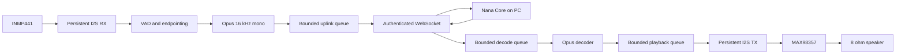

# Nana Presence Node: Xiaozhi Architecture Review

Date: 2026-07-22; reconciled 2026-08-12

Status: **RESEARCH COMPLETE / RESEARCH-ONLY. CONTROL-SESSION MILESTONE IS PHYSICALLY ACCEPTED ON THE REAL ESP32. THE BROADER FAILURE MATRIX AND OPUS MEDIA REMAIN OPEN BUT DEFERRED UNDER `ESP32-OWNER-HOLD-1`.**

> **Owner hold:** This document is architecture research only. Opus migration,
> failure-matrix execution, audio optimization, flashing, provisioning, and
> physical validation are deferred while Presence is `WAITING_OWNER`.
> Nothing here authorizes a live hardware action or reopens the hold.

This document records what was learned from the official Xiaozhi documentation
and the current `xiaozhi-esp32` source, which parts fit Nana, and which parts do
not. It is a Level 3 implementation reference under
`NANA_PRESENCE_NODE_STATE.md`, not a replacement for Nana's architecture.

## Executive Decision

Nana should borrow Xiaozhi's audio execution model, not Xiaozhi's cloud product
or persona architecture.

Adopt:

1. persistent I2S channels that are enabled and disabled instead of created and
   deleted for every turn;
2. dedicated bounded receive, decode, and playback queues;
3. explicit `decode_in_flight`, `output_in_flight`, and `playback_drained`
   ownership;
4. microphone re-arm only after playback has fully drained and the amplifier is
   hard-muted;
5. a versioned hello/capabilities/session contract;
6. Opus 16 kHz mono frames over an authenticated LAN WebSocket as the future
   media transport;
7. small internal-RAM DMA buffers, with PSRAM used only for optional non-DMA
   queues after PSRAM stability is proved independently;
8. sequence, timestamp, CRC, queue depth, underrun, timeout, and playback-drain
   telemetry.

Keep Nana-specific:

- Nana Core on the PC is the only owner of identity, relationship memory, STT,
  LLM, TTS policy, authorization, and high-level behavior.
- The ESP32-S3 remains a removable body adapter.
- Presence sampling stays bounded at about one frame per second in V1.
- Audio stays strict half-duplex until stationary V1 is accepted.
- MAX98357 `SD` and I2S data stay fail-closed while idle or after any error.

Defer:

- MQTT plus encrypted UDP;
- full-duplex audio and acoustic echo cancellation;
- on-device identity recognition or social memory;
- continuous high-FPS camera streaming;
- mobility before stationary camera, display, and audio soak acceptance;
- PSRAM at 80 MHz or any boot path that requires PSRAM.

## 2026-08-06 MQTT/UDP Reconciliation

The official MQTT/UDP page was reviewed again for Nana's interaction-latency
work. Its useful transport facts are:

- the ESP32 is the active MQTT client and reconnects itself;
- MQTT carries session/control negotiation while encrypted UDP carries Opus;
- audio is mono Opus in 60 ms frames, with sequence and timestamp metadata;
- the split reduces media head-of-line blocking but adds encryption, packet
  ordering, firewall/NAT, reliability, and observability work.

Nana adopts the active-client lifecycle immediately, but does not replace the
live-passed PCM/WebSocket route in the same change. The current implementation
stores the board URI/token in NVS, stores the PC token with current-user
Windows DPAPI, auto-enables the listener during normal Nana startup, and caps
ESP32 reconnect backoff at about five seconds. This removes startup ordering
and recurring token entry without weakening the accepted bounded media path.

Opus remains the next isolated A/B benchmark. It must beat PCM on measured
speech-to-first-audio latency and bandwidth while preserving exact drain,
hard mute, reconnect recovery, and audio quality before it can replace PCM.

## 2026-07-22 Control-Session Implementation

The first recommendation has now crossed from design into code without moving
audio at the same time. Nana Core owns an opt-in WebSocket server and the ESP32
owns a control-only client using:

```text
ws://<PC-LAN-IP>:8765/presence/v1
Authorization: Bearer <secret>

ESP32 -> hello(protocol, device_id, firmware, profile, capabilities)
Core  -> welcome(session_id, heartbeat_ms)
ESP32 -> heartbeat(sequence, uptime_ms)
Core  -> heartbeat_ack(sequence)
```

Properties already verified on the PC or at build time:

- missing and wrong bearer tokens fail the opening handshake;
- binary, oversized, malformed, and unknown milestone frames fail closed;
- one newest session owns a device ID and replaces an older duplicate;
- stale heartbeat closes the session;
- ESP32 uses bounded text reassembly and approximately 1, 2, 4, then 5 second
  reconnect backoff with up to 250 ms jitter;
- URI/token provisioning is one-time USB-UART input, stored in NVS, and token
  values are redacted from logs;
- Core loopback passed `5/5`, config smokes passed `18/18`, and the ESP-IDF
  5.5.5 image built with 39 percent of the smallest app partition free.
- The real board passed initial authenticated connection, three advancing
  heartbeats, reconnect after Core restart, reconnect after board hard reset,
  and ephemeral NVS credential cleanup. MAX98357 stayed hard-muted throughout.

This milestone advertises audio uplink/downlink, camera, and display as false.
It proves session ownership and liveness only. Plain `ws://` and plaintext NVS
credentials are acceptable only on the trusted private LAN bench; do not port
forward the service. WSS, device-bound credentials, and media are later gates.

## Evidence Set

Official documentation reviewed through the owner's live Edge debug session:

- [WebSocket protocol](https://xiaozhi.dev/en/docs/development/websocket/)
- [MQTT plus UDP protocol](https://xiaozhi.dev/en/docs/development/mqtt-udp/)
- [MCP overview](https://xiaozhi.dev/en/docs/development/mcp/)
- [MCP protocol](https://xiaozhi.dev/en/docs/development/mcp/protocol/)
- [MCP usage](https://xiaozhi.dev/en/docs/development/mcp/usage/)
- [Hardware guide](https://xiaozhi.dev/en/docs/usage/hardware-guide/)
- [FAQ](https://xiaozhi.dev/en/docs/usage/faq/)
- [ESP32 programming guide](https://xiaozhi.dev/en/docs/esp32/programming-guide/)
- [ESP32 troubleshooting](https://xiaozhi.dev/en/docs/esp32/troubleshooting/)
- [ESP32 technical specifications](https://xiaozhi.dev/en/docs/esp32/technical-specs/)
- [AI features](https://xiaozhi.dev/en/docs/ai-features/)

Source reviewed:

```text
Repository: https://github.com/78/xiaozhi-esp32.git
Commit:     5f6c09b8938ad08c6a16c0b1f526638207e58ed6
Date:       2026-07-19 22:45:03 +0800
```

Source evidence is stronger than marketing performance claims in documentation.
FPS, latency, and memory figures remain untrusted until reproduced on Nana's
exact board, firmware, power path, and network.

## What Xiaozhi Actually Does

### 1. I2S lifetime

`main/audio/codecs/no_audio_codec.cc` provides both shared-clock duplex and
separate-clock simplex implementations. Both are valid ESP32-S3 designs.

Important behavior:

- I2S channels are created in codec construction.
- `auto_clear_after_cb = true` prevents stale DMA output from repeating after a
  callback underrun.
- `EnableInput()` and `EnableOutput()` enable or disable existing channels.
- Normal turn transitions do not repeatedly delete and recreate the channel.

This means Nana's current GPIO 41/42 shared BCLK/WS design is not invalid by
itself. The observed `payload_read` timeout does not prove a pin collision.

### 2. Audio pipeline

`main/audio/audio_service.h` and `.cc` separate work into tasks and bounded
queues:

```text
microphone
  -> input task
  -> audio engine / VAD
  -> encode queue
  -> Opus task
  -> send queue
  -> network

network
  -> decode queue
  -> Opus task
  -> playback queue
  -> output task
  -> speaker
```

The source uses 16 kHz, mono, 16-bit Opus with 60 ms frames. Decode and send
queues are bounded to about 2400 ms. Playback PCM is also bounded instead of
allowing an unlimited producer to outrun the speaker.

### 3. Playback completion

Xiaozhi does not infer completion from "the last packet was received." It
tracks:

```text
decode queue empty
AND playback queue empty
AND decode_in_flight == false
AND output_in_flight == false
```

Only then does it emit `on_playback_drained`. Listening can be deferred until
that event. This is the correct model for Nana's strict half-duplex handoff.

### 4. WebSocket media session

The official WebSocket protocol uses:

- JSON for control messages;
- binary Opus frames for audio;
- `Authorization`, `Protocol-Version`, `Device-Id`, and `Client-Id` headers;
- a hello message containing transport, codec, sample rate, channel count, and
  frame duration;
- explicit listening, speaking, abort, TTS, STT, LLM, IoT, and MCP events.

The state discipline is more important than the exact message names:

```text
Idle
  -> Connecting
  -> Listening
  -> Speaking
  -> playback_drained
  -> Listening or Idle
```

Recording stops when TTS playback starts. It does not resume merely because
the final network frame arrived.

### 5. MQTT plus UDP

Xiaozhi's alternative protocol uses MQTT for JSON control and sequenced,
timestamped, encrypted UDP for Opus media. That split is useful for a larger
fleet or external cloud service. It adds more transport, encryption, NAT,
reordering, and observability work than Nana's one trusted LAN node currently
needs.

Decision: do not add MQTT plus UDP to stationary V1.

### 6. MCP

Xiaozhi wraps JSON-RPC 2.0 in MCP messages for capability discovery and tool
execution. Tools have names, descriptions, parameter schemas, ranges, defaults,
and callbacks.

Useful Nana adaptation later:

```text
self.display.set_expression
self.audio.set_volume
self.camera.capture
self.motion.stop
self.power.get_status
```

MCP is suitable for bounded hardware commands. It is not the audio media
transport and must not become a second owner of Nana's identity or planner.

## Current Nana Failure Interpretation

The strongest recent failure evidence was:

```text
component=speaker
stage=payload_read
code=ESP_ERR_TIMEOUT
remaining=17408 bytes
```

The audible result was a short valid prefix followed by continuous noise until
the turn ended. The speaker-only embedded PCM baseline had already played
cleanly on GPIO 41/42/47. Therefore the current evidence ranks causes as:

1. serial reply payload starvation or an incomplete unframed payload;
2. playback beginning before a sufficient lead buffer exists;
3. turn cleanup and I2S channel churn exposing stale DMA data;
4. internal-RAM fragmentation during repeated I2S allocation;
5. power or wiring noise;
6. pin conflict, still unproved.

The safe engineering conclusion is not "the pins are definitely wrong." The
safe conclusion is "the media pipeline needs frame ownership, flow control,
and measurable playback completion before changing the pin map."

## Nana Target Audio Architecture



Nana Core remains responsible for STT, LLM, memory, TTS, policy, and reply
generation. The ESP32 only owns real-time capture, framing, buffering, playback,
display, camera sampling, and fail-safe hardware states.

## Near-Term Serial Transport Repair

WebSocket and Opus are the target, but the trusted USB-UART path remains useful
as a diagnostic and rollback transport. Repair it with the same queue semantics:

1. Core sends a versioned `reply_begin` with sequence, sample format, total
   bytes, frame duration, and CRC.
2. Node starts its persistent output task and replies with a finite receive
   credit/window.
3. Core sends indexed frames, not one anonymous raw payload.
4. Node validates order and enqueues into a 150-300 ms internal-RAM jitter
   buffer before enabling the amplifier.
5. Core respects node credit instead of relying only on host-side sleeps.
6. Node reports received, queued, played, underruns, late frames, CRC, and final
   drain state.
7. Any timeout immediately clears DMA, drives DOUT low, drives `SD` low, drops
   the turn, and leaves the microphone suspended until cleanup finishes.
8. Microphone re-arm occurs only after `playback_drained` plus a short hard-mute
   guard.

This can prove the execution model before Wi-Fi replaces USB-UART.

## I2S And GPIO Decision

Current shared-clock map:

```text
BCLK:        GPIO41
WS/LRCLK:    GPIO42
speaker DIN: GPIO47
microphone:  GPIO21
amp SD:      GPIO2
```

Keep it for the first pipeline A/B test because a clean embedded speaker smoke
already passed on it and Xiaozhi proves shared-clock duplex is a valid design.

If the persistent-channel and framed-queue implementation still fails while
embedded PCM remains clean, run a controlled simplex A/B test:

```text
speaker BCLK: GPIO19
speaker WS:   GPIO20
speaker DOUT: GPIO47
mic BCLK/WS:  GPIO41/GPIO42
mic DIN:      GPIO21
```

This sacrifices native USB OTG pins 19/20, but CH343 UART programming remains
available. Do not remap until the transport test makes it necessary.

## PSRAM Decision

The board physically has 8 MiB octal PSRAM. Nana has also reproduced a reset
during the first real PSRAM heap integration path. Therefore:

- all I2S DMA descriptors and DMA buffers stay in internal DMA-capable RAM;
- the default bootable profile must not require PSRAM;
- PSRAM is tested in an isolated profile before camera/audio/display startup;
- PSRAM may later hold compressed Opus queues, camera framebuffers, or other
  large non-DMA objects;
- full 60-second reply buffering is not the target architecture;
- 80 MHz PSRAM is deferred until 40 MHz mapping and repeated access soak pass.

The local QIO plus 8 MiB octal PSRAM branch built successfully, but it is not a
live hardware acceptance. `COM14` was absent during this review, so it was not
flashed or verified.

## Camera And Presence Decision

Keep the accepted V1 behavior:

- camera service is request-driven;
- Core samples at no more than about one JPEG per second;
- frames remain in memory;
- YuNet face boxes are only a conservative presence proxy;
- two confirmations open a short audio lease;
- missing evidence closes the lease and hard-disables mic and speaker.

Do not combine camera FPS work with the audio transport repair. A 1 Hz presence
gate is enough for the current goal.

## Display Decision

Keep `nana.presence.face.v1` as a presentation adapter driven by bounded state
and expression tags. It may consume Core state events, but it must not own the
conversation state machine.

The useful Xiaozhi lesson is event ownership: display state changes should be
derived from the same listening, processing, speaking, failure, and drained
events used by audio. No independent animation path should guess whether the
speaker is finished.

## Acceptance Tests

### Audio baseline

1. Boot with MAX98357 VIN disconnected and verify no reset loop.
2. Verify PSRAM-disabled default profile reaches a stable heartbeat.
3. Connect VIN only while the owner is present.
4. Run speaker-only embedded PCM at 100 percent configured test volume.
5. Require clean audio and hard silence after completion.

### Framed serial pipeline

1. Short reply: 2-3 seconds.
2. Medium reply: 10-15 seconds.
3. Long reply: 45-60 seconds.
4. Deliberately pause the Core sender mid-turn.
5. Disconnect Core mid-turn.
6. Require fail-closed mute, no repeated stale sample, and clean recovery.
7. Record queue high-water, frame lateness, underflow count, bytes received,
   bytes played, CRC result, and drain latency.

### Combined runtime

1. Camera presence opens and closes the audio lease repeatedly.
2. Display animation remains smooth during capture and playback.
3. Mic stays suspended for the complete speaker interval.
4. Listening resumes only after playback drained.
5. Run 20 consecutive turns.
6. Run a 30-60 minute soak with heap and queue telemetry.

### WebSocket migration

1. Authenticated hello and capability negotiation: physical control-only pass.
2. Heartbeat and reconnect: physical initial, Core-restart, and board-reboot
   pass; Wi-Fi-loss plus the wider malformed/cancel/shutdown matrix remain open.
3. Opus 16 kHz mono, initially 60 ms frames.
4. Media sequence, timestamp, CRC, credit, and bounded queue validation.
5. End-to-end latency measurement from microphone capture to speaker output.
6. USB-UART retained as diagnostics and recovery, not the primary media path.

## Next Work Order (HISTORICAL / DEFERRED UNDER OWNER HOLD)

The list below records the last active research order. It is not an authorized
current task while `ESP32-OWNER-HOLD-1` is `WAITING_OWNER` / `DEFERRED`.

1. Complete Wi-Fi-loss, malformed-frame, cancellation, and repeated-shutdown
   acceptance while the amplifier remains hard-muted.
2. Replace per-turn I2S create/delete behavior with persistent channels and
   explicit enable/disable ownership.
3. Add framed serial receive credit, bounded playback queue, and
   `playback_drained` telemetry.
4. Re-run speaker-only and short/medium/long serial reply tests.
5. Close combined camera/display/audio lifecycle and soak gates.
6. Add Opus media frames to the already-authenticated session as Presence Voice
   Link V3.
7. Add MCP-like hardware tool schemas only after the media path is stable.

## Stop Point

```text
XIAOZHI ARCHITECTURE REVIEW 2026-07-22:
- Official docs and current source reviewed.
- Architecture recommendation is complete.
- Pin conflict is not proven.
- Latest audible failure is best explained by payload starvation/timeout.
- Session V1 control plane is implemented; Core loopback, ESP-IDF build, board
  flash/boot, hard mute, and same-subnet Wi-Fi join pass.
- Session media capabilities are deliberately disabled.
- The scoped firewall rule is installed for the exact Python executable, TCP
  `8765`, and the private `/24`; conflicting broad Python rules are disabled.
- Real ESP32 initial handshake/heartbeat, Core restart reconnect, board reboot
  reconnect, and ephemeral credential cleanup passed physically.
- Wi-Fi-loss and the wider D3 failure matrix are still unclaimed.
```

## 2026-08-06 Adopted Xiaozhi-Like Audio Scheduling

The relevant Xiaozhi lesson is now implemented without copying its cloud
service: start the speaker pipeline as soon as a bounded PCM prebuffer is
available, keep transport credits finite, and keep capture/playback
half-duplex. Nana Core still owns STT, LLM, TTS, identity, and policy.

The first implementation uses ElevenLabs' streaming PCM endpoint, 8192-byte
provider reads, 1024-byte authenticated WebSocket frames, and an eight-frame
ESP32 prebuffer. Buffered full-reply TTS remains an explicit fallback. This
improves time-to-first-audio; it does not reduce STT, LLM, or provider
time-to-first-byte by itself.

Acceptance evidence is currently local: server 19/19 and VoiceEngine 7/7.
The historical next evidence was a real short reply with `first_audio` and
`underruns=0`, followed by a buffered-vs-progressive comparison. That work is
deferred under `ESP32-OWNER-HOLD-1`; Opus remains an optional later bandwidth
experiment, also deferred, and is not a current authorization to change the
media path.
